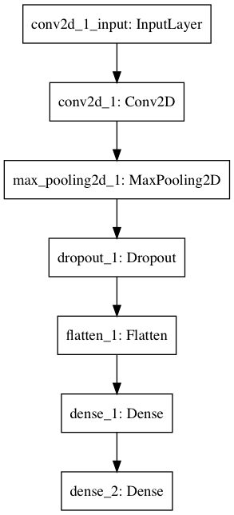
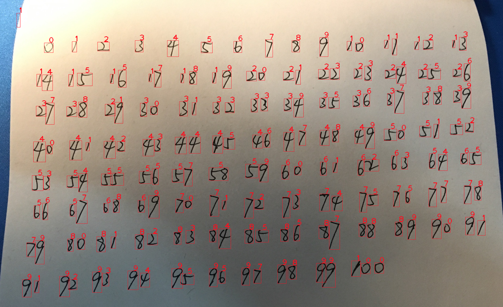

=======================
Naïve Digit Recognition
=======================

The project consists of two parts: basic task and advanced task.
Basic task is a MNIST digit classifer implemented in neural network.
And the advanced task is a handwriting digits recognizer.

----------
Basic Task
----------

Method: CNN

Accuracy: 99%

Model:

|cnn-model|

-------------
Advanced Task
-------------

The advanced task is aiming to recognize hand-writing digits in photos.
The whole process is divided into many stages, each of which is responsible for a sigle task.

Result:

|exp-result|

Since all of those digits are written by my self, which is totally different from the style of MNIST.
Plus some error in neural network. It only reaches 95% accuracy.

